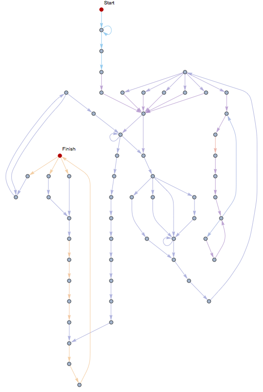

# Hardware Verification Workflow with SCR1 in Wolfram Mathematica
**Hackathon at Wolfram Technology Conference 2018 (Russia)**

[Wolfram Research Hackathon 2018](https://www.wolfram.com/events/technology-conference-ru/2018/hackathon.html)

We connected Wolfram Mathematica with SCR1 microcontroller.  For this purpose, we developed a driver for SCR1 based on Wolfram Device Framework. In our project SCR1 is not a hardware device but RTL code of processor in SystemVerilog.

A chip design workflow is a complicated multistage process. At the design stage, engineers describe their solutions in abstractions at the register-transfer level (RTL) using RTL languages such as SystemVerilog. At the verification stage, they prove that the design is corrected and this is the most complex phase of development. Wolfram Mathematica can help in verification providing comprehensive analytical and visualisation features.

In the project, we used SCR1 as an example of an RTL code because SCR1 is an open-source microcontroller core which is a RISC-V compatible processor. RISC-V is computer architecture which is open too. The source files of SCR1 can be found at the link http://github.com/syntacore/scr1. We present a solution where we can substitute SCR1 with any other RTL design. So our project is extensible, and we may say that we built a workflow involving Wolfram Mathematica. The project aims to demonstrate a potential application for Wolfram Mathematica to the semiconductor industry.


##What it can
The Wolfram Device Framework creates symbolic objects that represent external devices. In our case, this is the SCR1 processor. It is a frontend of our system.  A description of the backend is in the next section.

An SCR1 symbolic object has properties and three groups of methods — read, write and execute. In our project, users can interact with general purpose registers and memory of the SCR1. For this demonstration we additionally provided access to some wires such as memory data bus and branching logic in the processor pipeline. Examples are below.
## Properties
| Property           | Description                                                                                             |
| ------------------ | ------------------------------------------------------------------------------------------------------- |
| "State"            | The state reflects a state of the processor and can have the following values: IDLE, WORK and FINISHED. |
| "Clock"            | The clock contains the number of ticks of a clock signal from simulation start.                         |
| "IPC"              | The IPC (instruction pointer counter) shows an address of a currently executed instruction.             |
| "MAX_MEM"          | MAX_MEM is a size of memory in bytes.                                                                   |
These properties are read-only and can be accessed by the name of the property as follows.
```mathematica
device["MAX_MEM"]
```

## Methods
### Reading
```mathematica
DeviceRead[device, "CMD"]
```
| Command            | Description                                                                             |
| ------------------ | --------------------------------------------------------------------------------------- |
| "STATE"            | Read the state of SCR1 (State, Finished, Clock, IPC).                                   |
| "REGS"             | Read the list of registers values (from 1 to 32).                                       |
| "MEM"              | Read the list of bytes from memory.                                                     |
| "BRANCH"           | Read the state of branching logic (IPC, Jump, Branch_taken, Branch_not_taken, JB_addr). |
| "DBUS"             | read memory data bus (Address, Bytes).                                                  |

### Writing
```mathematica
DeviceWrite[device, "CMD"]
```
| Command            | Description                                                           |
| ------------------ | --------------------------------------------------------------------- |
| "REGS"             | Modify a value of a register.                                         |
| "MEM"              | Modify a value of a memory cell.                                      |

### Execution
```mathematica
DeviceExecute[device, "CMD"]
```
| Command            | Description                                                                                             |
| ------------------ | ------------------------------------------------------------------------------------------------------- |
| "RESET"            | Reset the processor.                                                                                    |
| "HARD_RESET"       | Reset the processor and internal counters of the simulator (such as simulation time and clock counter). |
| "LOAD"             | Load a program to memory and reset the processor.                                                       |
| "STEP"             | Perform one tick of the clock signal.                                                                   |
| "RUN"              | Make steps until the end of the program.                                                                |
| "RUN_UNTIL_IPC"    | Make steps until a specific IPC value.                                                                  |
| "TRACE_IPC"        | Execute "RUN" command and return a list of IPC values.                                                  |

<!-- ## Examples
### Execution graph (dhrystone)


### Read registers
```mathematica
Dataset[
 Table[
  {i, BaseForm[#, 16], BaseForm[#, 2]} &@
   DeviceRead[device, {"get_reg", i}]
  ,
  {i, 1, 31}
  ]
 ]
```


### Read memory
```mathematica
MatrixPlot[
  BlockMap[# &, Map[# &, DeviceRead[device, {"read_mem", 0, 32*1024}]],128],
  ColorFunction -> "TemperatureMap"
]
```
 -->


## SCR1
SCR1 is an open-source RISC-V compatible MCU core, designed by Syntacore.

* https://github.com/syntacore/scr1
* https://syntacore.com


