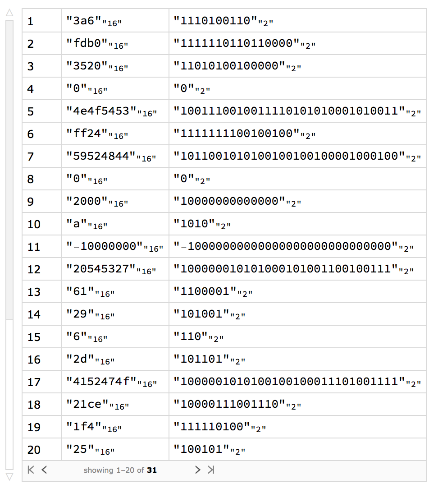
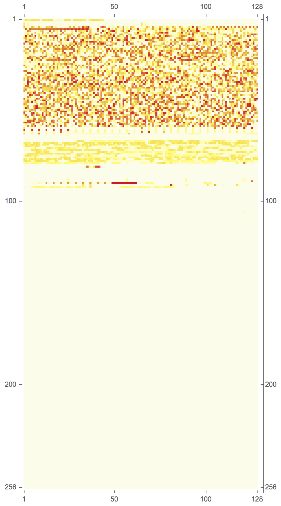

# Hardware Verification Workflow with SCR1 in Wolfram Mathematica
**Hackathon at Wolfram Technology Conference 2018 (Russia)**

[Wolfram Research Hackathon 2018](https://www.wolfram.com/events/technology-conference-ru/2018/hackathon.html)


## Commads
| Command            | Description                                 |
| ------------------ | ------------------------------------------- |
| "reset"            | Resets the processor and loads a program    |
| "run"              | Runs a program till $finish                 |
| "step"             | Makes CPU step (one clock)                  |
| "checkEnd"         | Returns True or False                       |
| "read_mem"         | Returns a list of bytes from the memory     |
| "ipc"              | Returns a value of the IPC register         |
| "next_ipc"         | Runs a program till an IPC change           |
| "get_reg_list"     | Returns a list of register's values         |
| "get_reg"          | Returns a value of the i-th register        |
| "get_branch_state" | Returns state of branch (see details below) |
| "get_data_bus"     | Returns a CPU <-> Memory bus value          |


## Examples
### Read registers
```mathematica
Dataset[
 Table[
  {i, BaseForm[#, 16], BaseForm[#, 2]} &@
   DeviceRead[device, {"get_reg", i}] 
  ,
  {i, 1, 31}
  ]
 ]
```


### Read memory
```mathematica
MatrixPlot[
  BlockMap[# &, Map[# &, DeviceRead[device, {"read_mem", 0, 32*1024}]],128],
  ColorFunction -> "TemperatureMap"
]
```



## SCR1
SCR1 is an open-source RISC-V compatible MCU core, designed by Syntacore.

* https://github.com/syntacore/scr1
* https://syntacore.com
