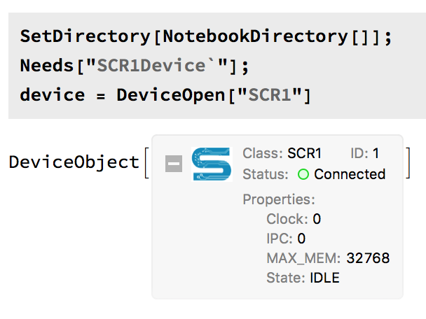

# Hardware Verification Workflow with SCR1 in Wolfram Mathematica
**Hackathon at Wolfram Technology Conference 2018 (Russia)**

[Wolfram Research Hackathon 2018](https://www.wolfram.com/events/technology-conference-ru/2018/hackathon.html)

We connected Wolfram Mathematica with SCR1 microcontroller core.  For this purpose, we developed a driver for SCR1 based on Wolfram Device Framework. In our project SCR1 is not a hardware device but RTL code of processor written in SystemVerilog.

A chip design workflow is a complicated multistage process. At the design stage, engineers describe their solutions in abstractions at the register-transfer level (RTL) using RTL languages such as SystemVerilog. At the verification stage, they have to prove that the design is correct and this is the most complex phase of development. Wolfram Mathematica can help in verification providing comprehensive analytical and visualisation features.

In the project, we used SCR1 as an example of an RTL code because SCR1 is an open-source microcontroller core which is a RISC-V compatible processor. RISC-V is computer architecture which is open too. The source files of SCR1 can be found at http://github.com/syntacore/scr1. We present a solution where we can substitute SCR1 with any other RTL design. So our project is extensible, and we may say that we built a workflow involving Wolfram Mathematica. The project aims to demonstrate a potential application for Wolfram Mathematica to the semiconductor industry. 

## What it can do
The Wolfram Device Framework creates symbolic objects that represents external devices. In our case, this is the SCR1 processor. It is a frontend of our system.  A description of the backend is in the next section.

An SCR1 symbolic object has properties and three groups of methods — read, write and execute. In our project, users can interact with general purpose registers and memory of the SCR1. For this demonstration we additionally provided access to some wires such as memory data bus and branching logic in the processor pipeline. Examples are below.

[Read more](docs/documentation.md)
