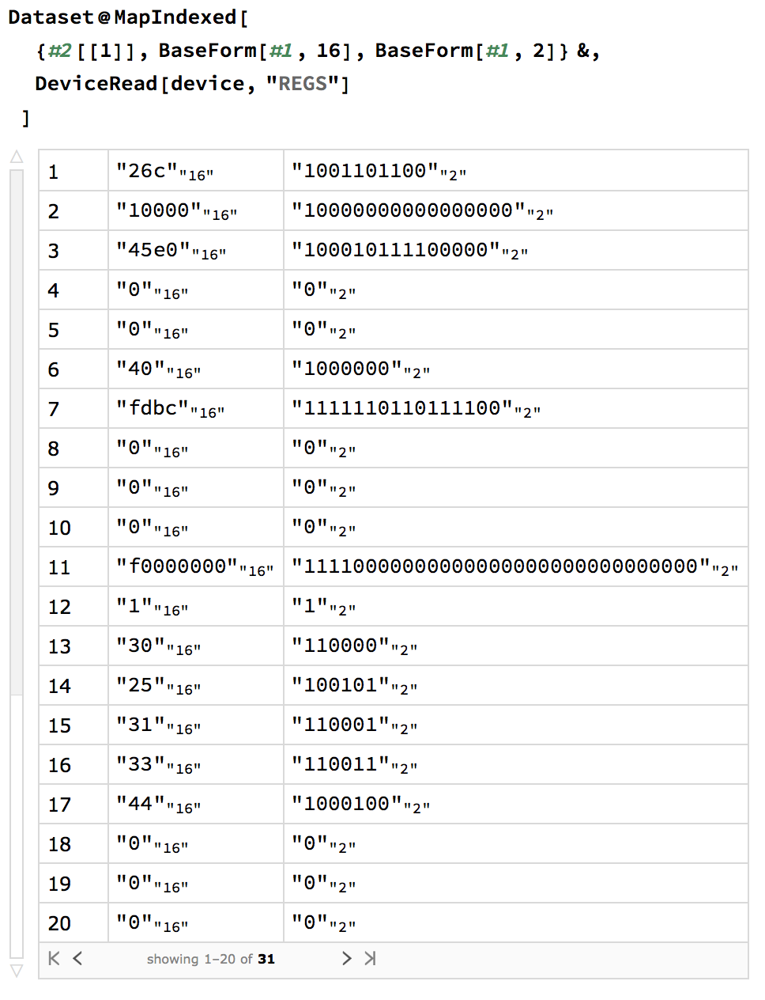
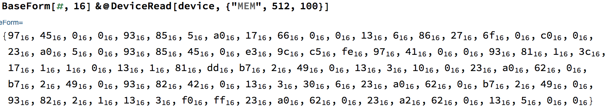

# Hardware Verification Workflow with SCR1 in Wolfram Mathematica
**Hackathon at Wolfram Technology Conference 2018 (Russia)**

[Wolfram Research Hackathon 2018](https://www.wolfram.com/events/technology-conference-ru/2018/hackathon.html)

We connected Wolfram Mathematica with SCR1 microcontroller.  For this purpose, we developed a driver for SCR1 based on Wolfram Device Framework. In our project SCR1 is not a hardware device but RTL code of processor in SystemVerilog.

A chip design workflow is a complicated multistage process. At the design stage, engineers describe their solutions in abstractions at the register-transfer level (RTL) using RTL languages such as SystemVerilog. At the verification stage, they prove that the design is corrected and this is the most complex phase of development. Wolfram Mathematica can help in verification providing comprehensive analytical and visualisation features.

In the project, we used SCR1 as an example of an RTL code because SCR1 is an open-source microcontroller core which is a RISC-V compatible processor. RISC-V is computer architecture which is open too. The source files of SCR1 can be found at the link http://github.com/syntacore/scr1. We present a solution where we can substitute SCR1 with any other RTL design. So our project is extensible, and we may say that we built a workflow involving Wolfram Mathematica. The project aims to demonstrate a potential application for Wolfram Mathematica to the semiconductor industry.


##What it can
The Wolfram Device Framework creates symbolic objects that represent external devices. In our case, this is the SCR1 processor. It is a frontend of our system.  A description of the backend is in the next section.

An SCR1 symbolic object has properties and three groups of methods — read, write and execute. In our project, users can interact with general purpose registers and memory of the SCR1. For this demonstration we additionally provided access to some wires such as memory data bus and branching logic in the processor pipeline. Examples are below.
## Properties
| Property           | Description                                                                                             |
| ------------------ | ------------------------------------------------------------------------------------------------------- |
| "State"            | The state reflects a state of the processor and can have the following values: IDLE, WORK and FINISHED. |
| "Clock"            | The clock contains the number of ticks of a clock signal from simulation start.                         |
| "IPC"              | The IPC (instruction pointer counter) shows an address of a currently executed instruction.             |
| "MAX_MEM"          | MAX_MEM is a size of memory in bytes.                                                                   |

These properties are read-only and can be accessed by the name of the property as follows.
```mathematica
device["MAX_MEM"]
```

## Methods
### Reading
```mathematica
DeviceRead[device, "CMD"]
```
| Command            | Description                                                                             |
| ------------------ | --------------------------------------------------------------------------------------- |
| "STATE"            | Read the state of SCR1 (State, Finished, Clock, IPC).                                   |
| "REGS"             | Read the list of registers values (from 1 to 32).                                       |
| "MEM"              | Read the list of bytes from memory.                                                     |
| "BRANCH"           | Read the state of branching logic (IPC, Jump, Branch_taken, Branch_not_taken, JB_addr). |
| "DBUS"             | read memory data bus (Address, Bytes).                                                  |

### Writing
```mathematica
DeviceWrite[device, "CMD"]
```
| Command            | Description                                                           |
| ------------------ | --------------------------------------------------------------------- |
| "REGS"             | Modify a value of a register.                                         |
| "MEM"              | Modify a value of a memory cell.                                      |

### Execution
```mathematica
DeviceExecute[device, "CMD"]
```
| Command            | Description                                                                                             |
| ------------------ | ------------------------------------------------------------------------------------------------------- |
| "RESET"            | Reset the processor.                                                                                    |
| "HARD_RESET"       | Reset the processor and internal counters of the simulator (such as simulation time and clock counter). |
| "LOAD"             | Load a program to memory and reset the processor.                                                       |
| "STEP"             | Perform one tick of the clock signal.                                                                   |
| "RUN"              | Make steps until the end of the program.                                                                |
| "RUN_UNTIL_IPC"    | Make steps until a specific IPC value.                                                                  |
| "TRACE_IPC"        | Execute "RUN" command and return a list of IPC values.                                                  |

## Basic examples
### Read data about SCR1
These are examples of reading commands output.


Here, "Finished" is a flag which is 1 if SCR1 reaches the end of the program
otherwise is zero. Other output values are the same as symbolic object
properties.


Structures like if–then–else create branches in code execution flow. The
"BRANCH" command returns information about the current branching state. "Jump",
"Branch_taken", "Branch_not_taken" are flags. They are 1 if the instruction is
jump or a branch has detected, and it has taken or not taken, respectively.
"JB_addr" is an address of the next instruction if jump or branch has occurred.


Data and instructions of programs are located in memory. A processor fetches
them through a memory bus. "DBUS" returns an address of memory cell and size of
requested data in bytes.


Any computations on the processor involve registers. We can read the values of
them. This is an example of reading values of the register in binary and
hexadecimal forms.


Also, we can read the content of the memory. The first argument is an address of
the cell. The second is the number of cells.

### Write data about SCR1


### Executions on SCR1
There are several functions which start processor working. The first is "STEP".
This function produces one clock of the simulator and returns the number of
clocks. This function works until the end of the program. After, reset SCR1. We
can use the “NEXT_IPC” function if we would like to run SCR1 until the next
instruction occurs. The function returns a value of new IPC. Additionally, SCR1
may be run till a particular IPC value with “RUN_UNTIL_IPC” command. If we
would like to launch SCR till the end of the program, we can use "RUN" function.
And If the program prints something to display, it is redirected to
src1_output.txt file.


## Additional examples

### Memory maps of programs
In this example, we show a grid of memory maps for programs from scr1_programs
directory. A memory map is a matrix of memory cells where each element is
highlighted depending on the value of the cell.


### Execution graph of programs
We can visualise the trace of program execution. We used a directed graph whose
vertices are instructions which are placed in order how they were executed. We
can see that using the graph it is easy to find jumps in programs.


### Call graph
There are assembler dumps in scr1_programs directory. We use this dumps to map
instructions to the names of functions. In this example, we parse assembler
files, find ranges of addresses and use them for mapping.


### Transactions to memory
This example shows how to trace data manually with Wolfram Mathematica. Also, we
calculate a list of frequent addresses which is accessed by SCR1 for a
particular program (dhrystone).


### Develop new devices: branch predictor
Our solution provides loads of data about microcontroller. Engineers may use
these data to design or optimise modules. For instance, we can get information
about branching of SCR1 and use this data for developing a branch predictor
module.

The purpose of the branch predictor is to improve the flow in the instruction
pipeline. Branch predictors play a critical role in achieving high performance
in many modern pipelined processors.

Here we use machine learning methods, a neural network, to build a predictor.


## How it works
The driver encapsulates lower-level interactions with the SCR1. We cannot use
SystemVerilog in Wolfram Mathematica directly. That is why we converted the SCR1
code to C++ code by Verilator software
(https://www.veripool.org/wiki/verilator). This program is an open-source
Verilog / System Verilog simulator. We wrapped generated C++ code with functions
to communicate with Wolfram Mathematica through Wolfram LibraryLink. The full
scheme of the project is below.


## SCR1
SCR1 is an open-source RISC-V compatible MCU core, designed by Syntacore.

* https://github.com/syntacore/scr1
* https://syntacore.com


